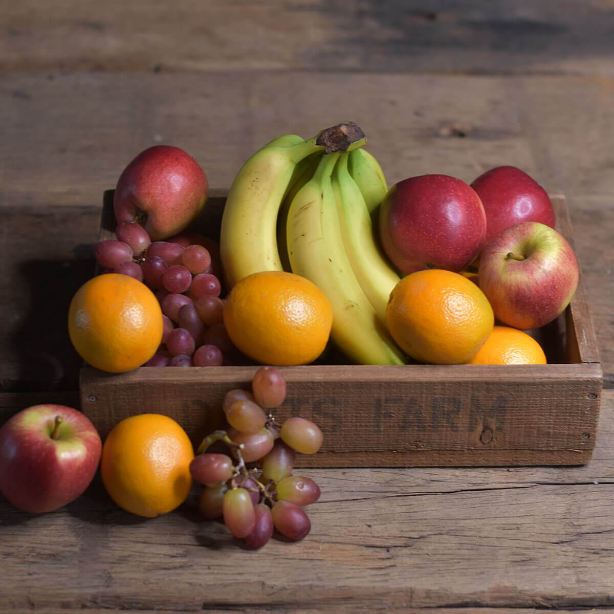

## Neural Style Word Transfer 

Our multi-style model is a modified version of Google Brain Team's [implementation](https://github.com/magenta/magenta/tree/main/magenta/models/image_stylization) of [A Learned Representation for Artistic Style](https://arxiv.org/abs/1610.07629). *Vincent Dumoulin, Jon Shlens, Manjunath Kudlur*.

## Multi-style Transfer Network
Below are various transforms of a photo of fruit from our multi-style model.

     

     

 

## Stylizing an Image
To stylize an image, download one of our pre-trained models and use `evaluate.py` as detailed below.
* Monet - [download](https://drive.google.com/file/d/1kClOmTppb7SPR2Z9pwUkgAM2ogOUIiZI/view?usp=sharing)

## Training a Single-Style Transfer Network
Before training can begin, style data must first be extracted from example style images using `extract_style.py`. All example style images must be saved in per-style directories within the style_files folder.

    python extract_style.py --style_files=path/to/style/img/dirs \
      --output_file=path/to/save/dir

Use `train.py` to train a new single-style transfer network. Run `python train.py` to view all the possible parameters. 
Example usage:

    python train.py \
      --train_dir=path/to/saved/model/dir \
      --style_dataset_file=file/containing/style/Grams \
      --num_styles=no_styles \
      --vgg_checkpoint=path/to/checkpoint \
      --image_dir=content/image/dir

## Evaluating a Single-Style Transfer Network
Use `evaluate.py` to evaluate a single-style transfer network. Run `python evaluate.py` to view all the possible parameters. 
Example usage:

    python evaluate.py --style_dir=path/to/style/name/dict  
    --checkpoint=path/to/checkpoint  
    --input_image=path/to/input/img  
    --which_styles="['list of style names']"   
    --output_dir=dir/to/save/output 
    --output_basename="stylised"

### License
Original model is "Copyright (c) 2016 Logan Engstrom. Contact me for commercial use (or rather any use that is not academic research) (email: engstrom at my university's domain dot edu). Free for research use, as long as proper attribution is given and this copyright notice is retained."

