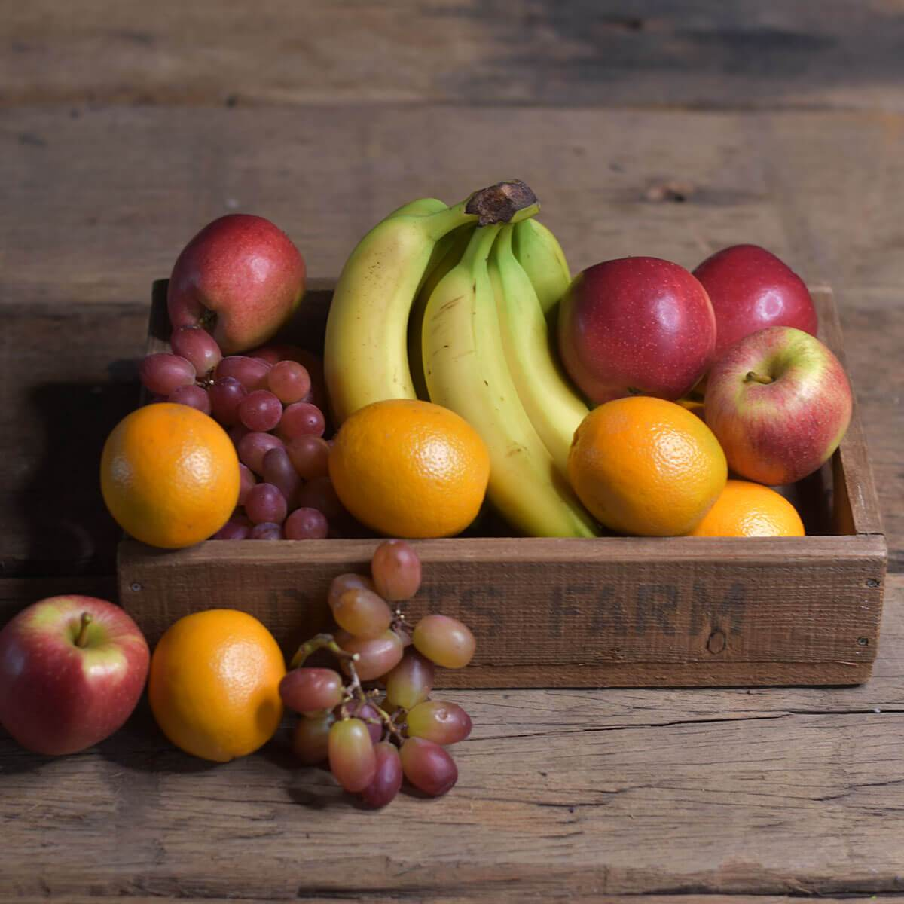

## Neural Style Word Transfer in TensorFlow

Transfer style from text descriptions to photos, from Neural Style Word Transfer for End-to-End Text-to-Art Generation *Nicole Saville*. All implementation details can be found in the dissertation above. 

Our single-style model is a modified version of Engstrom's [implementayion](https://github.com/lengstrom/fast-style-transfer) of Johnson's [Perceptual Losses for Real-Time Style Transfer and Super-Resolution](http://cs.stanford.edu/people/jcjohns/eccv16/), and Ulyanov's [Instance Normalization](https://arxiv.org/abs/1607.08022). 

Our multi-style model is a modified version of Google Brain Team's [implementation](https://github.com/magenta/magenta/tree/main/magenta/models/image_stylization) of [A Learned Representation for Artistic Style](https://arxiv.org/abs/1610.07629). *Vincent Dumoulin, Jon Shlens, Manjunath Kudlur*.

## Single-style Transfer Network
Below are various transforms of a photo of Cornell from our single-style model.

 

## Multi-style Transfer Network
Below are various transforms of a photo of Cornell from our multi-style model.

     

 

### Training and Evaluating
For details on how to train and evaluate our single- and multi-style models, see individual README's.

