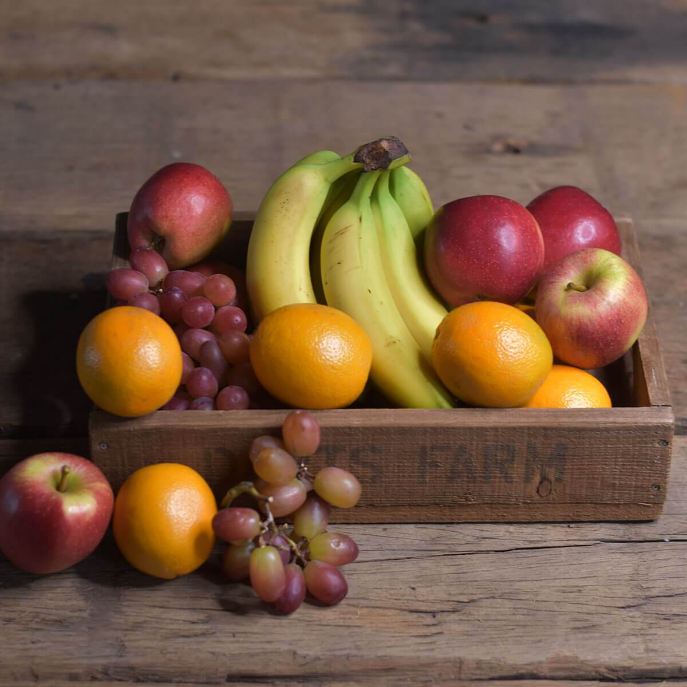

## Neural Style Word Transfer 

Transfer style from text descriptions to content photos 

Our single-style model is a modified version of Engstrom's (https://github.com/lengstrom/fast-style-transfer) implementation of Johnson's [Perceptual Losses for Real-Time Style Transfer and Super-Resolution](http://cs.stanford.edu/people/jcjohns/eccv16/), and Ulyanov's [Instance Normalization](https://arxiv.org/abs/1607.08022). 

Our multi-style model is
[A Learned Representation for Artistic Style](https://arxiv.org/abs/1610.07629). *Vincent Dumoulin, Jon Shlens,
Manjunath Kudlur*.

## Single-style Transfer Network
Below are various transforms of a photo of Cornell from our single-style model.

     

 

### Training our Single-Style Transfer Network
Use `singlestyle_train.py` to train a new single-style transfer network. Run `python singlestyle_train.py` to view all the possible parameters. 
Example usage:

    python singlestyle_train.py --style-dir path/to/style/dir \
      --checkpoint-dir checkpoint/path \
      --test-img path/to/test/img.jpg \
      --test-dir path/to/test/dir \
      --content-weight 1.5e1 \
      --checkpoint-iterations 200 \
      --batch-size 4

### Evaluating our Single-Style Transfer Network
Use `evaluate.py` to evaluate a single-style transfer network. Run `python evaluate.py` to view all the possible parameters. 
Example usage:

    python evaluate.py --checkpoint path/to/style/model.ckpt \
      --in-path dir/of/test/imgs/ \
      --out-path dir/for/results/

## Multi-style Transfer Network
Below are various transforms of a photo of Cornell from our multi-style model.

     

 

### Training our Multi-Style Transfer Network
Use `style.py` to train a new style transfer network. Run `python style.py` to view all the possible parameters. Training takes 4-6 hours on a Maxwell Titan X. [More detailed documentation here](docs.md#stylepy). **Before you run this, you should run `setup.sh`**. Example usage:

    python multistyle_train.py \
      --train_dir=path/to/train_dir \
      --style_dataset_file=image_stylization/style_features/ \
      --num_styles=4 \
      --vgg_checkpoint=image_stylization/vgg_16.ckpt \
      --image_dir=data/extracontent/

### Evaluating our Multi-Style Transfer Network
Use `evaluate.py` to evaluate a style transfer network. Run `python evaluate.py` to view all the possible parameters. Evaluation takes 100 ms per frame (when batch size is 1) on a Maxwell Titan X. [More detailed documentation here](docs.md#evaluatepy). Takes several seconds per frame on a CPU. **Models for evaluation are [located here](https://drive.google.com/drive/folders/0B9jhaT37ydSyRk9UX0wwX3BpMzQ?usp=sharing)**. Example usage:

    python evaluate.py --checkpoint path/to/style/model.ckpt \
      --in-path dir/of/test/imgs/ \
      --out-path dir/for/results/

### Requirements
You will need the following to run the above:
- TensorFlow 0.11.0
- Python 2.7.9, Pillow 3.4.2, scipy 0.18.1, numpy 1.11.2
- If you want to train (and don't want to wait for 4 months):
  - A decent GPU
  - All the required NVIDIA software to run TF on a GPU (cuda, etc)
- ffmpeg 3.1.3 if you want to stylize video

## Implementation Details
Our implementation uses TensorFlow to train a fast style transfer network. We use roughly the same transformation network as described in Johnson, except that batch normalization is replaced with Ulyanov's instance normalization, and the scaling/offset of the output `tanh` layer is slightly different. We use a loss function close to the one described in Gatys, using VGG19 instead of VGG16 and typically using "shallower" layers than in Johnson's implementation (e.g. we use `relu1_1` rather than `relu1_2`). Empirically, this results in larger scale style features in transformations.

Tested on
| Spec                        |                                                             |
|-----------------------------|-------------------------------------------------------------|
| Operating System            | Windows 10 Home                                             |
| GPU                         | Nvidia GTX 2080 TI                                          |
| CUDA Version                | 11.0                                                        |
| Driver Version              | 445.75                                                      |

### License
Copyright (c) 2016 Logan Engstrom. Contact me for commercial use (or rather any use that is not academic research) (email: engstrom at my university's domain dot edu). Free for research use, as long as proper attribution is given and this copyright notice is retained.

